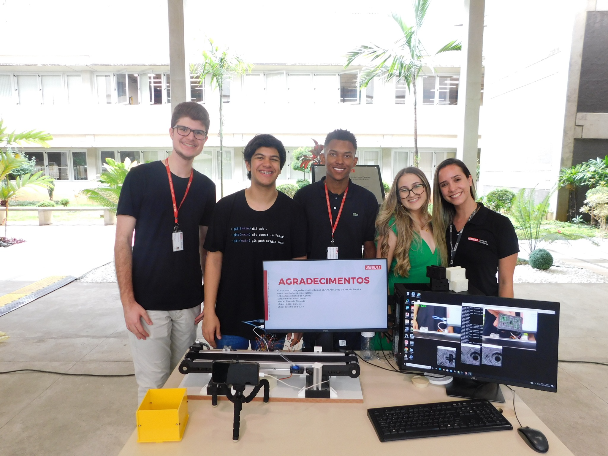
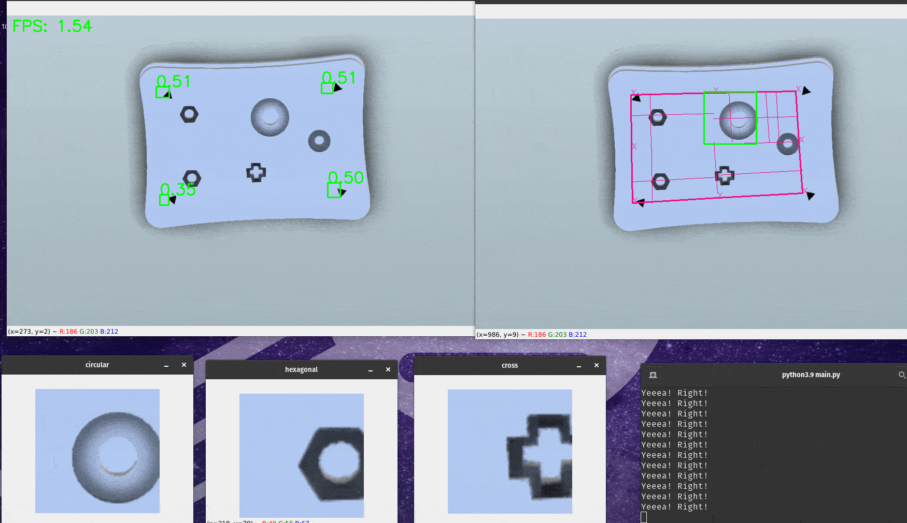
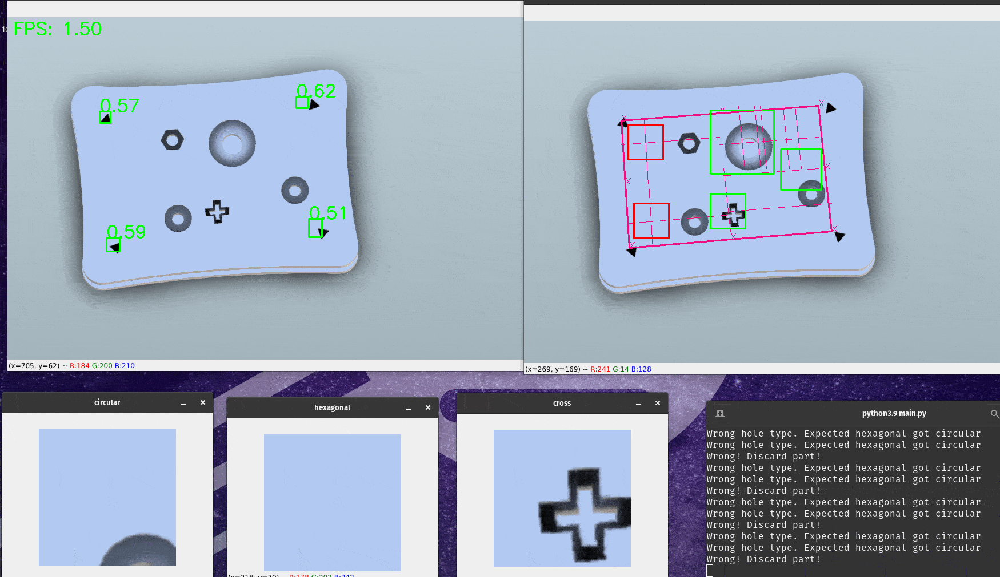
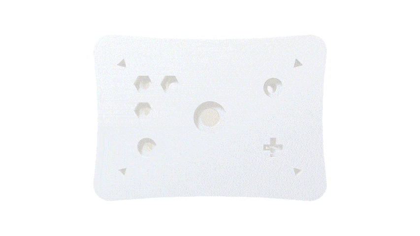
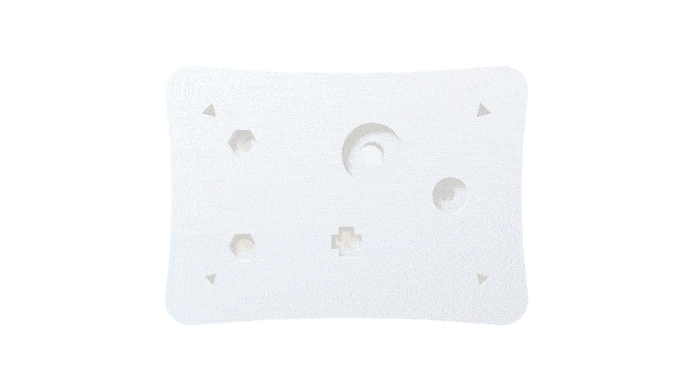

    

<h1 align="center">Inspeção de qualidade automatizada</h1>

<b>Uso de visão computacional para automatizar o processo de inspeção de qualidade de peças</b>

 <a href="#-demonstracao">Demonstração</a> • 
 <a href="#-integrantes">Integrantes</a> • 
 <a href="#-como-funciona">Como funciona</a> • 
 <a href="#-contribuindo">Contribuindo</a>

---
# ▶️ Demonstração

    </img>
    </img>

> Peça `B` correta (esquerda) e peça `B` errada (direita). Resultado no console no canto inferior direito

# 👤 Integrantes
Esse projeto foi desenvolvido durante o ano de 2022 no SENAI São Caetano do Sul, como projeto final do curso de Mecatrônica pelos técnicos:

  <table style="width:100%">
      <tr align="center">
          <th><strong>Eduardo Santos Barreto</strong></th>
          <th><strong>Karol Rodrigues</strong></th>
          <th><strong>Igor Podadera da Costa</strong></th>
          <th><strong>Guilherme Teodoro</strong></th>
      </tr>
      <tr align="center">
          <td>
              
          </td>
          <td>
              
          </td>
          <td>
              
          </td>
          <td>
              
          </td>
      </tr>
  </table>

    Orientadores:
    <a href="https://www.linkedin.com/in/leticiaaquino02/">Letícia Aquino</a>, 
    Sérgio Ferreira nascimento

## ❓ O problema
A inspeção de qualidade é um processo crucial na indústria para garantir que os produtos sejam produzidos de acordo com os padrões de qualidade estabelecidos. Apesar disso, muitas vezes ela é realizada manualmente, o que pode ocasionar erros e atrasos na produção, além da necessidade de uma equipe para essa inspeção.

A automação desse processo pode trazer diversos benefícios, como o aumento da confiabilidade, produtividade e escala.

## 💡 Ideia
O projeto consiste na implementação de um sistema de inspeção de qualidade automatizado simplificado, que utiliza visão computacional detectar falhas em peças. O sistema é composto por uma câmera, um computador e um software que realiza a inspeção.

## ⚙️ Como funciona

### Peça de exemplo
Para desenvolvermos o projeto, criamos algumas peças para serem utilizadas como exemplo.

    <a href="https://a360.co/3FMKbrW">
        </img>
    </a>
    <a href="https://a360.co/3Uq6Q1t">
        </img> 
    </a>

Elas são denominadas como `A` e `B`, e possuem suas versões corretas e erradas (para teste). Também tem um ID associado a elas, a peça `A` possui o ID `1001` e a peça `B` possui o ID `1002`, para efeitos de demonstração.

Todas as peças possuem entalhes triangulares em suas extremidades, que são utilizados para referência na inspeção.

### Rotina de validação

Assim que uma peça nova chega na visão da câmera, a rotina de validação é a seguinte:

1. Um modelo de detecção de objetos é utilizado para detectar os entalhes triangulares na peça e obter a posição deles.

2. A posição dos entalhes é utilizada para delimitar o espaço de inspeção.

3. O centro da peça é encontrado por meio dos pontos médios das linhas que delimitam o espaço de inspeção.

4. A peça é separada em quadrantes para que a inspeção seja feita em cada um deles.

5. Coleta de dados dos furos da peça do banco de dados, contendo principalmente as posições e os tamanhos de cada furo

6. Varredura da lista de furos obtida no banco de dados, comparando cada furo com os dados obtidos na inspeção.

    6.1. A partir da posição em X e Y do furo no quadrante, é obtida uma nova área de interesse do tamanho do diâmetro do furo.

    6.2. A área de interesse é utilizada para detectar se o furo está presente ou não na peça, usando um modelo de classificação de imagens.

7. Furos corretos nas posições corretas são marcados com um retângulo verde. Qualquer erro é marcado com um retângulo vermelho.

8. É gerado uma saída indicando se a peça é válida ou não, e quais furos estão errados.

### Por que usar quadrantes?
O uso de visão computacional pode ocasionar em problemas devido a variações de iluminação, reflexos e outros fatores. Um dos problemas que podem ocorrer é a peça vir inclinada em relação à câmera, o que poderia ocasionar em uma detecção incorreta dos furos, afinal, haveria uma distorção na imagem.

Quando usamos quadrantes, a peça é dividida em 4 partes, e cada uma delas é inspecionada separadamente, usando as bordas mais próximas como referência. Dessa forma, a distorção não causa tanto problema, pois a referência é distorcida igualmente (ou de um jeito muito próximo).

O segredo está em usar linhas paralelas às bordas para desenhar as linhas de referência da posição do furo, e não linhas paralelas à borda da imagem.

Veja esse exemplo com a peça `B` totalmente inclinada:

# 📫 Contribuindo
Se quiser contribuir com este projeto basta seguir essas etapas:

1. Faça um Fork desse repositório
2. Crie um branch: `git checkout -b <nome_branch>`.
3. Faça suas alterações, adicione e confirme: `git add .` e `git commit -m "<mensagem_commit>"`
4. Envie para a branch original: `git push origin master`
5. Crie o pull request.

Você também pode ver na documentação do GitHub [como criar um pull request](https://help.github.com/en/github/collaborating-with-issues-and-pull-requests/creating-a-pull-request).

> Issues e Stars são sempre bem vindas :)